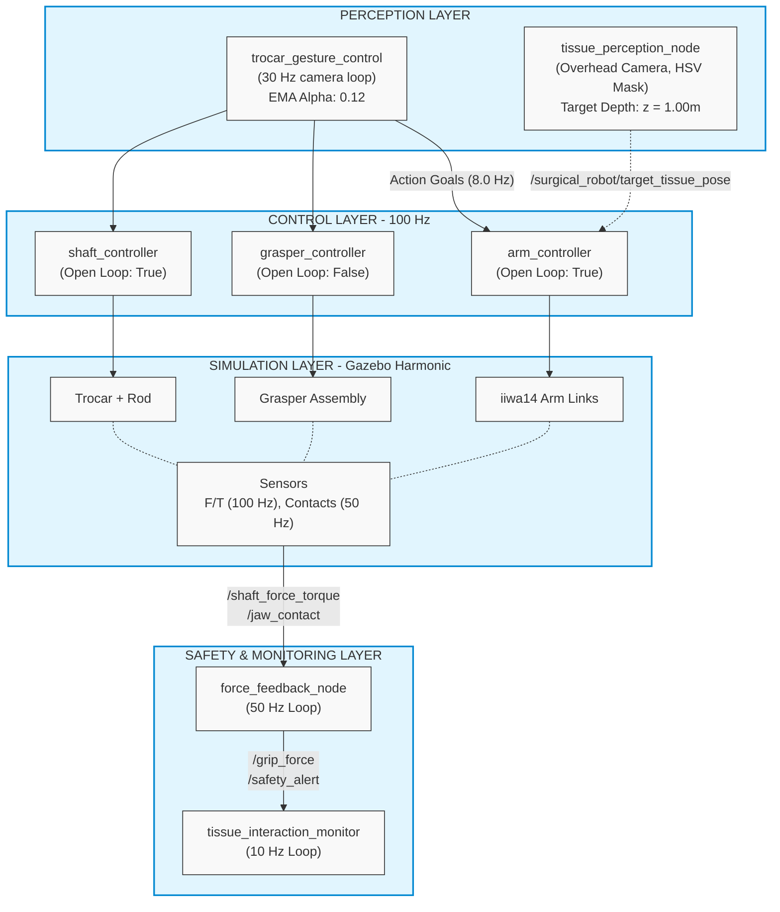

<div align="center">

<h1>🦾 Laparoscopic Grasper Surgical Robot</h1>

<p>
  <strong>A full-stack ROS 2 surgical robotics simulation featuring a 7-DOF KUKA iiwa14 arm, a dVRK-style laparoscopic grasper, real-time hand gesture control via MediaPipe, and force-feedback tissue safety monitoring — all running in Gazebo Harmonic.</strong>
</p>

<p>
  
  
  
  
  
</p>

</div>

---

## 📋 Table of Contents

- [Overview](#-overview)
- [System Architecture](#-system-architecture)
- [Hardware & Kinematic Constraints](#-hardware--kinematic-constraints)
- [Control Systems & Latency](#-control-systems--latency)
- [Gesture Control Mapping](#-gesture-control-mapping)
- [Tissue Safety & Force Thresholds](#-tissue-safety--force-thresholds)
- [Vision & Perception Parameters](#-vision--perception-parameters)
- [Package Structure](#-package-structure)
- [Installation & Setup](#-installation--setup)
- [Running the Simulation](#-running-the-simulation)
- [Launch Files](#-launch-files)
- [ROS 2 Topics Reference](#-ros-2-topics-reference)

---

## 🔬 Overview

This project implements a high-fidelity simulation of a laparoscopic surgical robot system. It is designed for quantitative research in human-robot interaction during surgical teleoperation, evaluating intuitive **hand gesture control** pipelines against established quantitative safety thresholds and system latencies. 

**Key Capabilities:**

| Feature | Detail |
|---|---|
| Robot Arm | 7-DOF KUKA LBR iiwa14 (redundant, torque-controlled) |
| End Effector | dVRK-style laparoscopic grasper with roll/pitch/yaw/jaw |
| Trocar Mechanism | Prismatic shaft translation for trocar insertion depth |
| Gesture Input | Real-time hand tracking via Google MediaPipe (30 Hz) |
| Force Sensing | Simulated F/T sensor (100 Hz) + contact sensors (50 Hz) |
| Tissue Safety | Quantitative force thresholds for 4 distinct tissue types |
| Tissue Perception | Vision-based color segmentation for tissue localization |
| Simulation | Gazebo Harmonic with `gz_ros2_control` hardware interface |

---

## 🏗️ System Architecture

The architecture isolates high-frequency control loops from asynchronous perception systems. This ensures that the robot maintains stability and safety even if the vision processing drops frames or the human operator provides erratic inputs.



---

## 🦾 Hardware & Kinematic Constraints

Rigorous physical limits are mapped to the robot URDF models to ensure physically realistic simulation. The redundant 7-DOF arm allows the system to reach targets while avoiding obstacles (or the patient's body), while the trocar mechanism mimics the constrained motion of a surgical tool passing through an incision port.

### KUKA LBR iiwa14 Arm Limits
| Joint | Position Limit (rad) | Max Effort (Nm) | Max Velocity (rad/s) |
|---|---|---|---|
| J1 (Base Yaw) | ±2.96 (170°) | 320 | 1.48 (85°) |
| J2 (Shoulder Pitch) | ±2.09 (120°) | 320 | 1.48 (85°) |
| J3 (Elbow Yaw) | ±2.96 (170°) | 176 | 1.74 (100°) |
| J4 (Elbow Pitch) | ±2.09 (120°) | 176 | 1.30 (75°) |
| J5 (Wrist Yaw) | ±2.96 (170°) | 110 | 2.26 (130°) |
| J6 (Wrist Pitch) | ±2.09 (120°) | 40 | 2.35 (135°) |
| J7 (Flange Roll) | ±3.05 (175°) | 40 | 2.35 (135°) |

### Trocar & End-Effector Limits

*Explanation:* The `shaft_translation_joint` is a prismatic joint simulating the insertion of the tool through a trocar port. It has artificially high damping (5.0) and friction (1.0) applied to prevent the rod from slipping and falling out of the patient under the effects of gravity when unpowered.

| Joint | Type | Limit (Position/Angle) | Max Effort | Max Velocity | Dynamics |
|---|---|---|---|---|---|
| `shaft_translation_joint` | Prismatic | 0.0 to 0.08 m | 100.0 N | 0.5 m/s | Damping: 5.0, Friction: 1.0 |
| `grasper_roll_joint` | Revolute | ±3.1415 rad | 10.0 Nm | 2.0 rad/s | - |
| `grasper_pitch_joint` | Revolute | ±1.57 rad | 5.0 Nm | 1.5 rad/s | - |
| `grasper_yaw_joint` | Revolute | ±1.57 rad | 5.0 Nm | 1.5 rad/s | - |
| `grasper_jaw_joint` | Revolute | 0.0 to 0.8 rad | 1.0 Nm | 2.0 rad/s | - |

*(Note: `jaw_right_joint` mimics `grasper_jaw_joint` with a multiplier of -1.0 to achieve symmetric scissors opening).*

---

## ⏱️ Control Systems & Latency

In a teleoperation context, human hand movements can be erratic and jittery. The control parameters below are carefully tuned to bridge the gap between noisy human input and strict robotic execution.

### Controller Manager (`ros2_controllers.yaml`)
- **System Update Rate:** 100 Hz (10 ms period)
- **Arm Controller (`open_loop_control: true`)**: Because gestures change rapidly, the arm constantly receives new waypoints. Setting open loop to `true` allows the controller to seamlessly accept new setpoints without throwing "aborted due to state tolerance violation" errors.
  - Stopped velocity tolerance: `0.01` rad/s
  - Goal tolerance: `0.30` rad (J1-J4), `1.00` rad (J5-J7)
- **Grasper Controller (`open_loop_control: false`)**: The grasper requires extreme precision to safely interact with tissue, so it runs in closed-loop mode. It must verify it has reached its target state before proceeding.
  - Stopped velocity tolerance: `0.05` rad/s
- **Shaft Controller (`open_loop_control: true`)**: Instantly drives to commanded positions, preventing the prismatic rod from dropping under gravity.
  - Stopped velocity tolerance: `0.005` m/s

### Gesture Control Pipeline (`trocar_gesture_control.py`)
- **Camera Frame Rate:** Target 30 Hz (33.3 ms per loop)
- **Trajectory Command Rate (`CMD_HZ`):** 8.0 Hz (125 ms interval between command dispatches). Sending commands faster than this overloads the ROS action server queue.
- **Trajectory Completion Time (`TRAJ_MS`):** 400 ms. Each chunk of motion is scheduled to take slightly longer than the command rate, resulting in a continuous, smooth spline rather than stop-and-go jerking.
- **Smoothing Filter:** Exponential Moving Average (EMA) with `α = 0.12`.
  - *Equation:* `smoothed = 0.12 * target + 0.88 * previous_smoothed`
  - *Why:* This heavily smooths MediaPipe hand-tracking noise, producing a highly stable teleoperation feed at the cost of a slight, intentional lag.

---

## 🖐️ Gesture Control Mapping

The system relies on distinct hand shapes to switch operating modes dynamically, solving the problem of controlling an 11-DOF system with a 3D hand position.

| Gesture | Hand Shape | Controlled Subsystem | Action & Mathematical Mapping |
|---|---|---|---|
| **Default / Open** | Relaxed hand | 7-DOF Arm | Wrist X/Y → Base/Shoulder (`-1.8` to `1.8` rad). Palm Yaw/Pitch/Roll → J3/J4/J5. Spread → J7 |
| **✊ FIST** | All fingers curled | Grasper Jaw | Closes jaw (Latches jaw target to `0.0` rad) |
| **🖐 OPEN** | All fingers extended | Grasper Jaw | Opens jaw (Target `0.8` rad, releases latch) |
| **✌ VICTORY** | Index + middle up | Trocar Shaft | Wrist Y (relative 0.2 to 0.7) → Shaft depth (`0.0` to `0.08` m) |
| **☝ POINT** | Index only up | Grasper Wrist | Hand X/Y/Z → Roll (`±3.14`), Pitch (`±1.5`), Yaw (`±1.5` rad) |
| **🤟 ROCK ON** | Thumb+index+pinky | Arm Wrist | Hand X/Y → Fine tune J5 (`±1.5` rad) / J6 (`0.5` to `1.5` rad) |
| **👎 THUMBS DOWN** | Thumb pointing down| Trocar Shaft | **Emergency retract** shaft immediately to `0.0` m |

---

## 🛡️ Tissue Safety & Force Thresholds

Surgical simulators often suffer from physics engine artifacts where contact sensors fail to register collisions on very thin meshes. Our safety system uses a multi-layered approach to ensure forces are always accurately tracked.

### Force Feedback Fusion (`force_feedback_node.py`)
Runs a **50 Hz** monitoring loop consolidating force inputs into a single `/surgical_robot/grip_force` metric using a priority cascade:
1. **Primary Sensor:** Gazebo `Contacts` sensor on `jaw_left` & `jaw_right` (Update rate: 50 Hz). Computes the sum of collision wrench magnitudes.
2. **Secondary Fallback:** Joint effort `abs(effort)` from `/joint_states`. If the physics engine doesn't fire a contact event but the controller is struggling to close the jaw, this effort spike is caught.
3. **Synthetic Resistance:** If the jaws close beyond `0.1` rad but no contact is registered, the node injects a simulated resistance profile to ensure the operator still receives feedback.
   - *Equation:* `sim_force = 0.8 + (0.1 - jaw_pos) * 5.0` N.

### Interaction Monitor (`tissue_interaction.py`)
Runs a **10 Hz** monitoring loop tracking the duration and peak force of every continuous contact event (Trigger threshold: `> 0.05 N`). Logs interactions based on four empirically defined tissue profiles:

| Tissue Type | Safe Force (N) | Warning Force (N) | Critical Force (N) |
|---|---|---|---|
| **Liver** | 1.5 | 2.0 | 2.8 |
| **Intestine** | 0.8 | 1.2 | 1.8 |
| **Gallbladder** | 1.0 | 1.5 | 2.2 |
| **Fat** | 2.0 | 2.8 | 3.5 |

*(Configured via ROS parameter `tissue_type`, defaults to `liver` with fallback to `gallbladder`).*

**Safety Alerts Triggering:**
- **WARNING:** Exceeds tissue Warning force. Operator is advised to reduce grip.
- **CRITICAL:** Exceeds tissue Critical force. Triggers potential automated E-STOPs.

---

## 👁️ Vision & Perception Parameters

The perception node acts as a simplified computer vision pipeline, allowing the system to automatically calculate the required 3D trajectories for autonomous tissue retrieval sequences.

### Tissue Localization (`tissue_perception_node.py`)
- **Camera Pose:** Overhead fixed at `[x=0.5, y=0.0, z=2.0]` looking straight down.
- **Camera Specs:** Resolution 640x480, HFOV `1.047` rad (60 degrees).
- **Target Tissue Plane:** Assumes a flat target depth of `z = 1.0` m.
- **Segmentation:** HSV filtering for red hues (Ranges: `0-10, 100-255, 100-255` and `160-180, 100-255, 100-255` to handle the hue wrap-around).
- **Filtration:** Minimum contour area of `> 500` pixels required for centroid calculation.
- **Projection Math:** Uses a pinhole camera model with the known HFOV and Z-depth to project the 2D pixel centroid into a 3D `PoseStamped` world coordinate.

### Grasper Endoscope (`grasper.xacro`)
- **Specs:** 15 Hz update rate, Resolution 640x480, HFOV `1.2` rad, Clipping `0.01` to `10.0` m.
- Mounted directly at the `grasper_yaw_link`, providing a first-person tool view.

---

## 📁 Package Structure

```text
surgical_robot_ws/
└── src/
    └── laproscopic_grasper/
        ├── config/
        │   └── ros2_controllers.yaml      # 100Hz controller tuning parameters
        ├── launch/
        │   ├── surgical_robot.launch.py   # MAIN: Simulator + Controllers + App Nodes
        │   ├── trocar_gesture.launch.py   # Standalone Gesture Controller
        │   ├── surgical_system.launch.py  # Headless Application Stack
        │   └── gui_control.launch.py      # Tkinter Test GUI
        ├── scripts/
        │   ├── trocar_gesture_control.py  # MediaPipe Hand Tracking (30Hz, alpha=0.12)
        │   ├── force_feedback_node.py     # Force Fusion & Alert generation (50Hz)
        │   ├── tissue_interaction.py      # Quantitative Peak Force & Session Logger (10Hz)
        │   ├── tissue_perception_node.py  # Vision Localization (HSV, Area>500)
        │   ├── grasper_controller.py      # Scripted Surgical Sequence API
        │   └── force_visualizer.py        # Real-Time Matplotlib HUD
        ├── urdf/
        │   ├── laproscopic_grasper.urdf.xacro  # Top-level Robot Assembler
        │   ├── iiwa14_limits.xacro             # KUKA Joint Constraints
        │   ├── trocar_mechanism.xacro          # Prismatic Shaft 
        │   └── grasper.xacro                   # dVRK-style Jaw
        └── worlds/
            └── surgical_or.world          # Operating Room Environment
```

---

## ⚙️ Installation & Setup

1. **Clone the repository:**
   ```bash
   git clone https://github.com/<your-username>/surgical_robot_ws.git
   cd surgical_robot_ws
   ```

2. **Run Dependency Installer:**
   Installs ROS 2 Jazzy core, Gazebo Harmonic, `ros-gz-bridge`, and build tools.
   ```bash
   chmod +x src/laproscopic_grasper/install_dependencies.sh
   ./src/laproscopic_grasper/install_dependencies.sh
   ```

3. **Configure MediaPipe Virtual Environment:**
   MediaPipe requires isolation to avoid system package conflicts.
   ```bash
   cd src/laproscopic_grasper
   python3 -m venv .venv
   source .venv/bin/activate
   pip install mediapipe opencv-python numpy matplotlib
   deactivate
   cd ../..
   ```

4. **Build the Workspace:**
   ```bash
   source /opt/ros/jazzy/setup.bash
   colcon build --symlink-install
   source install/setup.bash
   ```

---

## ▶️ Running the Simulation

### 1. Launch the Full Simulator (Terminal 1)
Bootstraps Gazebo, spawns the KUKA, activates the 100 Hz `ros2_control` loop, and initializes application nodes.
```bash
source install/setup.bash
ros2 launch laproscopic_grasper surgical_robot.launch.py tissue_type:=liver
```
> *Wait ~10 seconds for controller initialization before proceeding.*

### 2. Launch the Gesture Controller (Terminal 2)
```bash
source install/setup.bash
ros2 launch laproscopic_grasper trocar_gesture.launch.py
```

### 3. Launch GUI Controller (Optional Alternative)
```bash
ros2 launch laproscopic_grasper gui_control.launch.py
```

---

## 📡 ROS 2 Topics Reference

### Inter-Node Communication Matrix

| Topic Name | Message Type | Publisher | Consumer | Rate / Note |
|---|---|---|---|---|
| `/surgical_robot/shaft_force_torque` | `geometry_msgs/WrenchStamped` | `ros_gz_bridge` | `force_feedback_node` | 100 Hz |
| `/surgical_robot/jaw_left_contact` | `ros_gz_interfaces/Contacts` | `ros_gz_bridge` | `force_feedback_node` | 50 Hz |
| `/surgical_robot/jaw_right_contact`| `ros_gz_interfaces/Contacts` | `ros_gz_bridge` | `force_feedback_node` | 50 Hz |
| `/surgical_robot/grip_force` | `std_msgs/Float32` | `force_feedback_node` | `tissue_interaction`, Visualizer | 50 Hz, Fused Output |
| `/surgical_robot/safety_alert` | `std_msgs/String` | `force_feedback_node` | `tissue_interaction`, Controller | OK/WARN/CRIT |
| `/surgical_robot/interaction_report`| `std_msgs/String` | `tissue_interaction` | - | 0.2 Hz (Summary) |
| `/surgical_camera/image_raw` | `sensor_msgs/Image` | `ros_gz_bridge` | `tissue_perception_node` | 60° FOV, Overhead |
| `/surgical_robot/target_tissue_pose`| `geometry_msgs/PoseStamped` | `tissue_perception_node`| - | 3D Space Mapping |
| `/diagnostics` | `diagnostic_msgs/DiagnosticArray` | `force_feedback_node` | - | 1 Hz, HW Status |

### Action Servers (`FollowJointTrajectory`)

| Action | Controlled Joints | Target Goal Constraints |
|---|---|---|
| `/arm_controller` | `iiwa14_joint1` – `iiwa14_joint7` | Position commands, `0.0`s goal time |
| `/grasper_controller` | `grasper_roll_joint`, `pitch`, `yaw`, `jaw` | Closed-loop precision required |
| `/shaft_controller` | `shaft_translation_joint` | Rapid response required to avoid drop |

---

<div align="center">
  <sub>Built with ROS 2 Jazzy · Gazebo Harmonic · MediaPipe · Python 3</sub>
</div>
