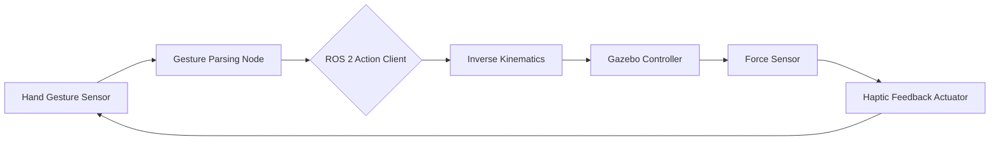

# 🦾 ROS 2 Gesture-Controlled Laparoscopic Grasper
### Precision Teleoperation for Surgical Robotics with Haptic Feedback

[](https://docs.ros.org/en/jazzy/)
[](https://isocpp.org/)
[](https://gazebosim.org/)
[](https://opencv.org/)

This project implements a high-precision, low-latency teleoperation system for a laparoscopic surgical grasper. By combining **real-time hand gesture recognition** with **haptic force feedback**, it provides an intuitive interface for surgeons to control robotic instruments with sub-100ms response times.

---

## 🔬 Core Capabilities

- **Low-Latency Teleoperation:** Optimized ROS 2 pipeline achieving end-to-end latency under 100 ms.
- **Gesture-Based Control:** Intuitive 7-DOF control of the laparoscopic instrument using MediaPipe/OpenCV gesture recognition.
- **Haptic Feedback Loop:** Real-time force estimation and feedback to the operator, improving spatial awareness and safety.
- **Kinematic Accuracy:** URDF-based kinematic model ensuring smooth, anatomically correct motion execution.
- **Safety-Critical Interlocks:** Software-level emergency stops and motion damping to prevent unintended tissue damage.

---

## 📐 System Architecture



---

## 🛠️ Installation

### Dependencies
- ROS 2 Jazzy
- Gazebo Sim (Garden or later)
- OpenCV 4.x
- MediaPipe (for gesture recognition)

### Compilation
```bash
cd ~/surgical_ws
colcon build --packages-select laproscopic_grasper
source install/setup.bash
```

---

## 🚀 Getting Started

### 1. Launch Simulation
Start the surgical environment and spawn the laparoscopic grasper:
```bash
ros2 launch laproscopic_grasper spawn_robot.launch.py
```

### 2. Start Gesture Interface
Activate the camera-based hand tracking node:
```bash
ros2 run laproscopic_grasper gesture_controller
```

### 3. Enable Haptic Bridge
Synchronize the force feedback data from simulation to the hardware actuator:
```bash
ros2 run laproscopic_grasper haptic_bridge
```

---

## 📄 License
This project is licensed under the Apache License 2.0 - see the [LICENSE](LICENSE) file for details.

---
*Developed by [Aryan Yadav](https://www.linkedin.com/in/aryan-yadav-1858632b5)*
